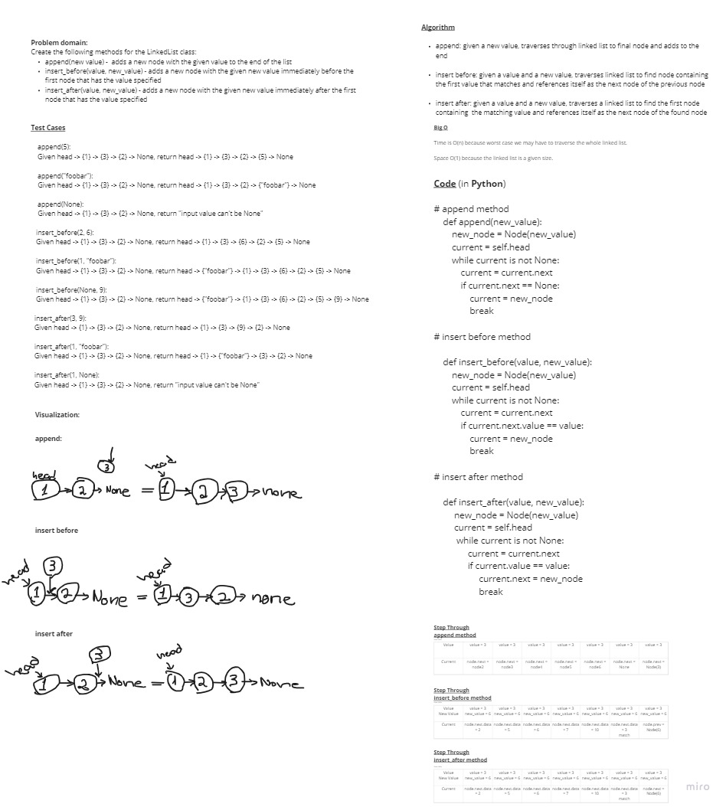

# Code Challenge 06: Singly Linked List

## Challenge Description:
Traverses a singly linked list one way and has methods to append, insert before, and insert after.

## Whiteboard Process

## Approach & Efficiency

Big O(n) for time and space is 1.
The time is takes will depend on the number of nodes.
The space it consumes will always be static, unless added to by method.

## API
No API used
